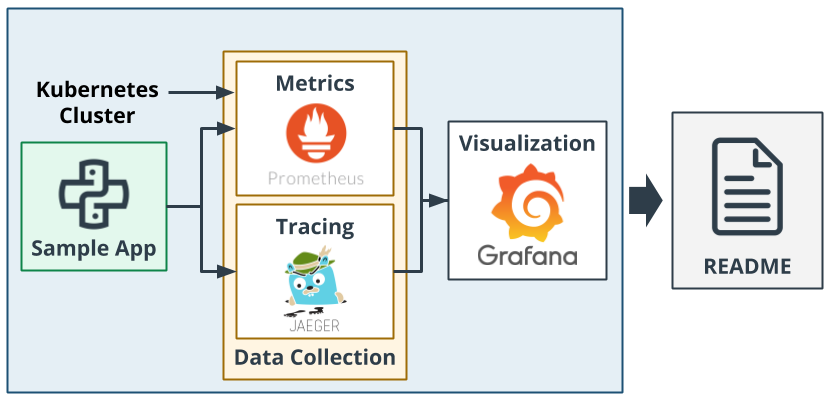
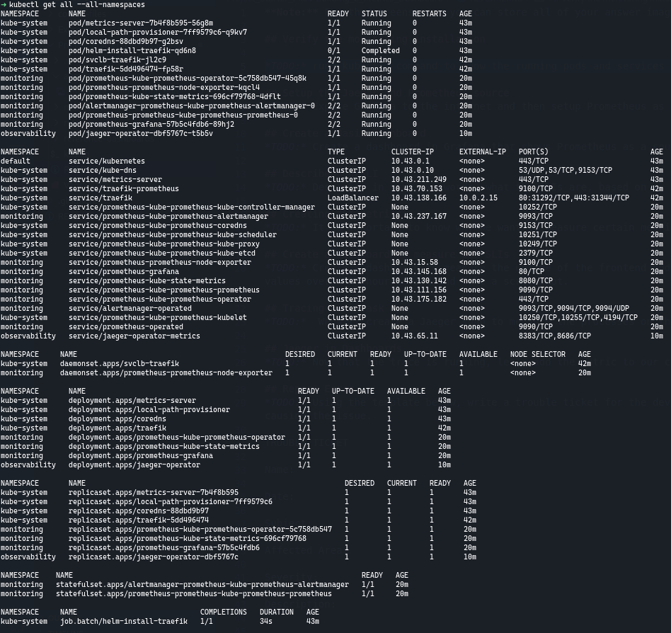
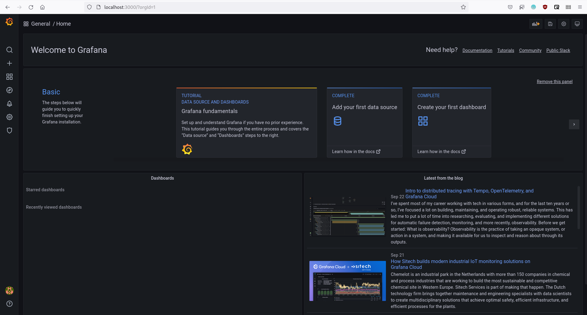
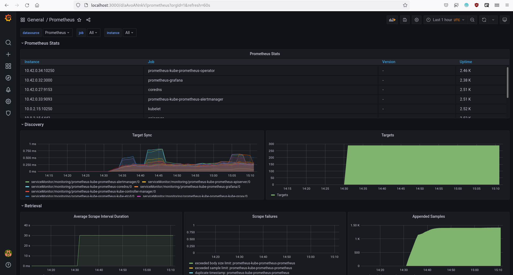

# Metrics Dashboard

In this project, you will create dashboards that use multiple graphs to monitor our sample application that is deployed on a Kubernetes cluster. You will be using Prometheus, Jaeger, and Grafana in order to monitor, trace and visualize your experience.

## Main Steps

Here are the main steps you'll carry out for this project:

    Deploy the sample application in your Kubernetes cluster.
    Use Prometheus to monitor the various metrics of the application.
    Use Jaeger to perform traces on the application.
    Use Grafana in order to visualize these metrics in a series of graphs that can be shared with other members on your team.
    Document your project in a README.

The process is summarized in the diagram below.



## Verify the monitoring installation

```shell
$ kubectl get all --all-namespaces
```


## Setup the Jaeger and Prometheus source

```shell
$ kubectl patch svc prometheus-grafana -n monitoring -p '{"spec": {"type": "LoadBalancer"}}'
$ kubectl port-forward svc/prometheus-grafana --address 0.0.0.0 3000:80 -n monitoring
```


## Create a Basic Dashboard



## Describe SLO/SLI

Suppose that these are our SLOs for *monthly uptime* and *request response time*:
1. 99.99% uptime in the year.
2. 95% of requests completed in < 100 ms.

We can describe SLIs as:
1. We got 99.98% uptime in the current year.
2. 94% of the requests were completed in < 100 ms.

## Creating SLI metrics.
*TODO:* It is important to know why we want to measure certain metrics for our customer. Describe in detail 5 metrics to measure these SLIs. 

## Create a Dashboard to measure our SLIs
*TODO:* Create a dashboard to measure the uptime of the frontend and backend services We will also want to measure to measure 40x and 50x errors. Create a dashboard that show these values over a 24 hour period and take a screenshot.

## Tracing our Flask App
*TODO:*  We will create a Jaeger span to measure the processes on the backend. Once you fill in the span, provide a screenshot of it here.

## Jaeger in Dashboards
*TODO:* Now that the trace is running, let's add the metric to our current Grafana dashboard. Once this is completed, provide a screenshot of it here.

## Report Error
*TODO:* Using the template below, write a trouble ticket for the developers, to explain the errors that you are seeing (400, 500, latency) and to let them know the file that is causing the issue.

TROUBLE TICKET

Name:

Date:

Subject:

Affected Area:

Severity:

Description:


## Creating SLIs and SLOs
*TODO:* We want to create an SLO guaranteeing that our application has a 99.95% uptime per month. Name three SLIs that you would use to measure the success of this SLO.

## Building KPIs for our plan
*TODO*: Now that we have our SLIs and SLOs, create KPIs to accurately measure these metrics. We will make a dashboard for this, but first write them down here.

## Final Dashboard
*TODO*: Create a Dashboard containing graphs that capture all the metrics of your KPIs and adequately representing your SLIs and SLOs. Include a screenshot of the dashboard here, and write a text description of what graphs are represented in the dashboard.  
