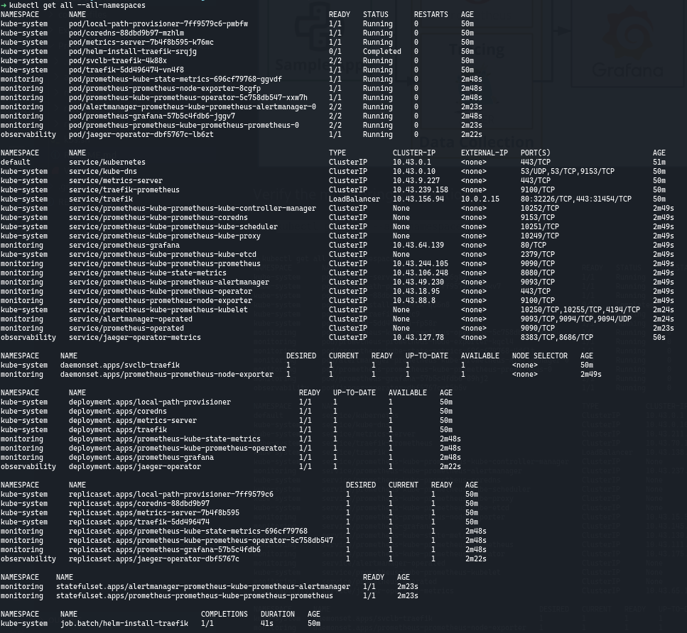
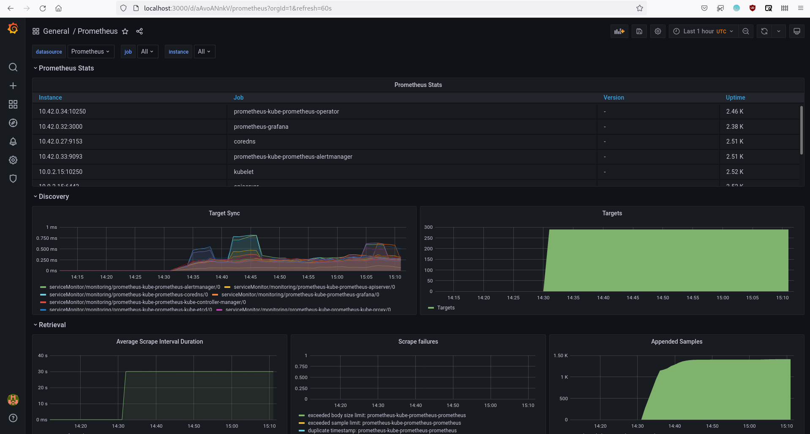
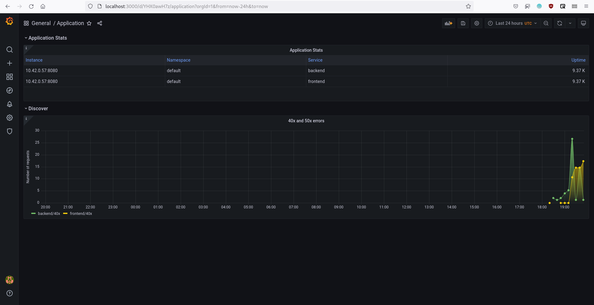

# Metrics Dashboard

Metrics Dashboard is a project that implements microservices observability using the Prometheus-Grafana-Jaeger stack. This is a project for the Udacity's Cloud Native Application Architecture Nanodegree.

## Table of Contents

+ [Table of Contents](#table-of-contents)
+ [Main steps](#main-steps)
+ [Verify the monitoring installation](#verify-the-monitoring-installation)
+ [Setup the Jaeger and Prometheus source](#setup-the-jaeger-and-prometheus-source)
+ [Create a basic dashboard](#create-a-basic-dashboard)
+ [Describe SLO/SLI](#describe-slosli)
+ [Creating SLI metrics](#creating-sli-metrics)
+ [Create a dashboard to measure our SLIs](#create-a-dashboard-to-measure-our-slis)
+ [Tracing our Flask app](#tracing-our-flask-app)
+ [Jaeger in dashboards](#jaeger-in-dashboards)
+ [Report error](#report-error)
+ [Creating SLIs and SLOs](#creating-slis-and-slos)
+ [Building KPIs for our plan](#building-kpis-for-our-plan)
+ [Final dashboard](#final-dashboard)

## Main steps

1. Deploy a sample application in your Kubernetes cluster.
2. Use Prometheus to monitor the various metrics of the application.
3. Use Jaeger to perform traces on the application.
4. Use Grafana in order to visualize these metrics in a series of graphs that can be shared with other members on your team.
5. Document the project in a README.

## Verify the monitoring installation

```shell
$ kubectl get all --all-namespaces
```


## Setup the Jaeger and Prometheus source

```shell
$ kubectl patch svc prometheus-grafana -n monitoring -p '{"spec": {"type": "LoadBalancer"}}'
$ kubectl port-forward svc/prometheus-grafana --address 0.0.0.0 3000:80 -n monitoring
```


## Create a basic dashboard



## Describe SLO/SLI

Suppose that these are our SLOs for *monthly uptime* and *request response time*:
1. 99.99% uptime in the year.
2. 95% of requests completed in < 100 ms.

We can describe SLIs as:
1. We got 99.98% uptime in the current year.
2. 94% of the requests were completed in < 100 ms.

## Creating SLI metrics

1. **Number of error responses in a period of time** - This metric could help us to identify possible bootlenecks and bugs.
2. **The average time taken to return a request** - This metric could help us to identify opportunities to tune our services performance.
3. **The average time taken recover a service if it goes down** - This metric could help us to measure our capacity to recover possible failovers.
4. **Percentage of uptime in a period of time** - This metric could help us to measure the health of our services.
5. **Average percentage of memory or CPU used by a service in a period of time** - This metric could help us to measure the impact of our services in the costs of maintaining a system and look for efficient services.

## Create a dashboard to measure our SLIs



## Tracing our Flask app


## Jaeger in dashboards


## Report error
*TODO:* Using the template below, write a trouble ticket for the developers, to explain the errors that you are seeing (400, 500, latency) and to let them know the file that is causing the issue.

TROUBLE TICKET

Name: 

Date:

Subject:

Affected Area:

Severity:

Description:


## Creating SLIs and SLOs

SLO: 99.95% uptime per month.

Our SLO corresponds to the following periods of allowed downtime/unavailability:
* Daily: 43s
* Weekly: 5m 2s
* Monthly: 21m 54s
* Quarterly: 1h 5m 44s
* Yearly: 4h 22m 58s

SLIs:
1. We got less than 21 minutes of downtime in the last month.
2. We got 2 minutes downtime in the past week for the current month.

## Building KPIs for our plan
*TODO*: Now that we have our SLIs and SLOs, create KPIs to accurately measure these metrics. We will make a dashboard for this, but first write them down here.

## Final dashboard
*TODO*: Create a Dashboard containing graphs that capture all the metrics of your KPIs and adequately representing your SLIs and SLOs. Include a screenshot of the dashboard here, and write a text description of what graphs are represented in the dashboard.  
