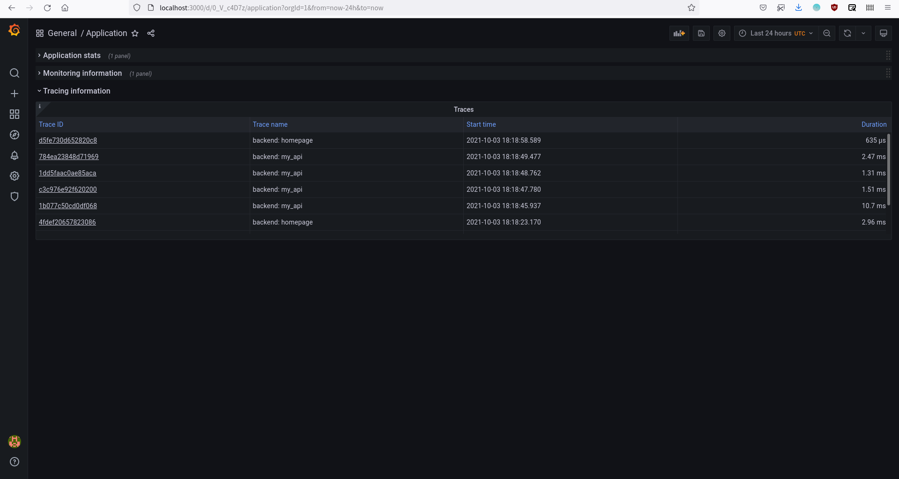

# Metrics Dashboard

Metrics Dashboard is a project that implements microservices observability using the Prometheus-Grafana-Jaeger stack. This is a project for the Udacity's Cloud Native Application Architecture Nanodegree.

## Table of Contents

+ [Table of Contents](#table-of-contents)
+ [Main steps](#main-steps)
+ [Verify the monitoring installation](#verify-the-monitoring-installation)
+ [Setup the Jaeger and Prometheus source](#setup-the-jaeger-and-prometheus-source)
+ [Create a basic dashboard](#create-a-basic-dashboard)
+ [Describe SLO/SLI](#describe-slosli)
+ [Creating SLI metrics](#creating-sli-metrics)
+ [Create a dashboard to measure our SLIs](#create-a-dashboard-to-measure-our-slis)
+ [Tracing our Flask app](#tracing-our-flask-app)
+ [Jaeger in dashboards](#jaeger-in-dashboards)
+ [Report error](#report-error)
+ [Creating SLIs and SLOs](#creating-slis-and-slos)
+ [Building KPIs for our plan](#building-kpis-for-our-plan)
+ [Final dashboard](#final-dashboard)

## Main steps

1. Deploy a sample application in your Kubernetes cluster.
2. Use Prometheus to monitor the various metrics of the application.
3. Use Jaeger to perform traces on the application.
4. Use Grafana in order to visualize these metrics in a series of graphs that can be shared with other members on your team.
5. Document the project in a README.

## Verify the monitoring installation


## Setup the Jaeger and Prometheus source


## Create a basic dashboard


## Describe SLO/SLI

Suppose that these are our SLOs for *monthly uptime* and *request response time*:
1. 99.99% uptime in the year.
2. 95% of requests completed in < 100 ms.

We can describe SLIs as:
1. We got 99.98% uptime in the current year.
2. 94% of the requests were completed in < 100 ms.

## Creating SLI metrics

1. **Number of error responses in a period of time** - This metric could help us to identify possible bootlenecks and bugs.
2. **The average time taken to return a response** - This metric could help us to identify opportunities to tune our services performance.
3. **The average time taken recover a service if it goes down** - This metric could help us to measure our capacity to recover possible failovers.
4. **Total uptime in a period of time** - This metric could help us to measure the health of our services.
5. **Average percentage of memory or CPU used by a service in a period of time** - This metric could help us to measure the impact of our services in the costs of maintaining a system and look for efficient services.

## Create a dashboard to measure our SLIs


## Tracing our Flask app


## Jaeger in dashboards



## Report error

```markdown
**TROUBLE TICKET**

**Name**: Franky River
**Date**: 09/27/2021 5:15:10 PM
**Subject**: Front-end service is creating many 40x and 50x errors
**Affected Area**: API requests
**Severity**: High

**Description**:
The `static/js/click.js` file is not handling clicks correctly and requests can not be processed because the
fetch url are not right.
```

## Creating SLIs and SLOs

SLIs:
1. We got less than 10 error responses in the last 24 hours.
2. We got an average response time of < 2000ms per minute.
3. We got 75% more successful responses than errors.
4. 99% of our responses had the right data format.

SLO:
1. 99.9% uptime per month.
2. 99.9% of responses to our front-service will return 2xx, 3xx or 4xx HTTP code within 2000 ms.
3. 99.99% of transaction requests will succeed over any calendar month.
4. 99.9% of backend service requests will succeed on their first attempt.

## Building KPIs for our plan

1. We got less than 10 error responses in the last 24 hours.
    + Successful requests per minute:  this KPI indicates how well is performed our system.
    + Error requests per minute: this KPI is an analogous of this SLI.
    + Uptime - this KPI indicates if errors are comming from downtime or not.
2. We got an average response time of < 2000ms in the las 24 hours.
    + Average response time:  this KPI is an analogous of this SLI.
    + Uptime - this KPI will help us to determine if response time is affected by downtime of a service.
3. We got 75% more successful responses than errors.
    + Successful requests per minute:  this KPI indicates the number of successful request.
    + Error requests per minute: this KPI indicates the number of error requests.

## Final dashboard


+ Application stats panel - This panel shows information about the application services.
+ Successful requests per minute - This panel shows the total number of successful requests per service.
+ Error requests per minute - This panel shows the total number of 40x and 50x error requests per service.
+ Average response time per minute - This panel shows the average response time successful requests (status 200) per service.
+ Average memory used per minute - This panel shows the average memory used by each service.
+ Average CPU used per minute - This panel shows the average CPU used by each service.
+ Network I/O Pressure - This panel shows the amount of I/O operations per minute in the node.